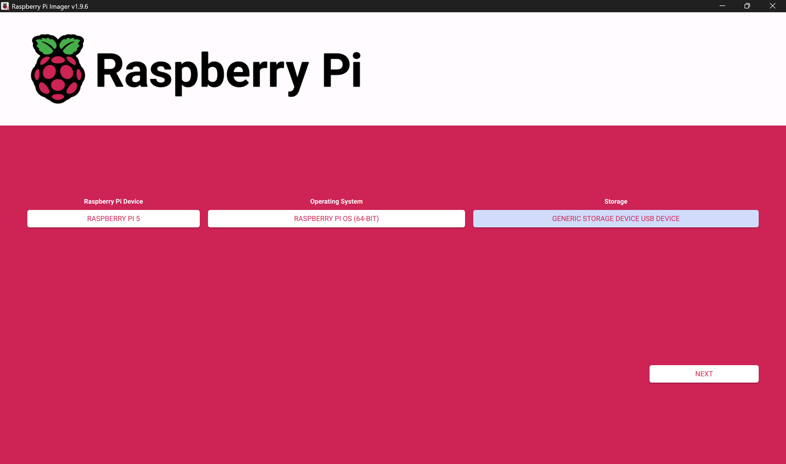
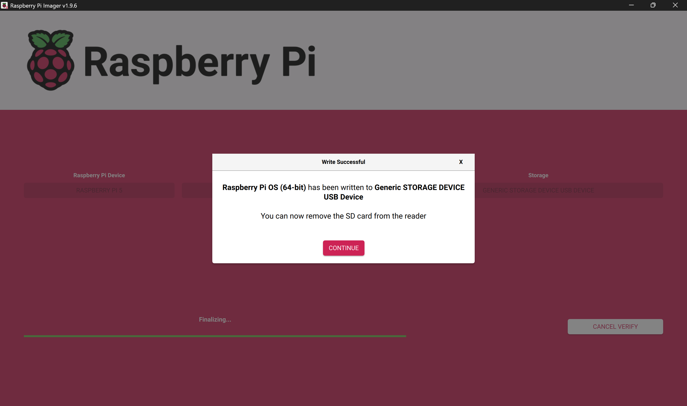
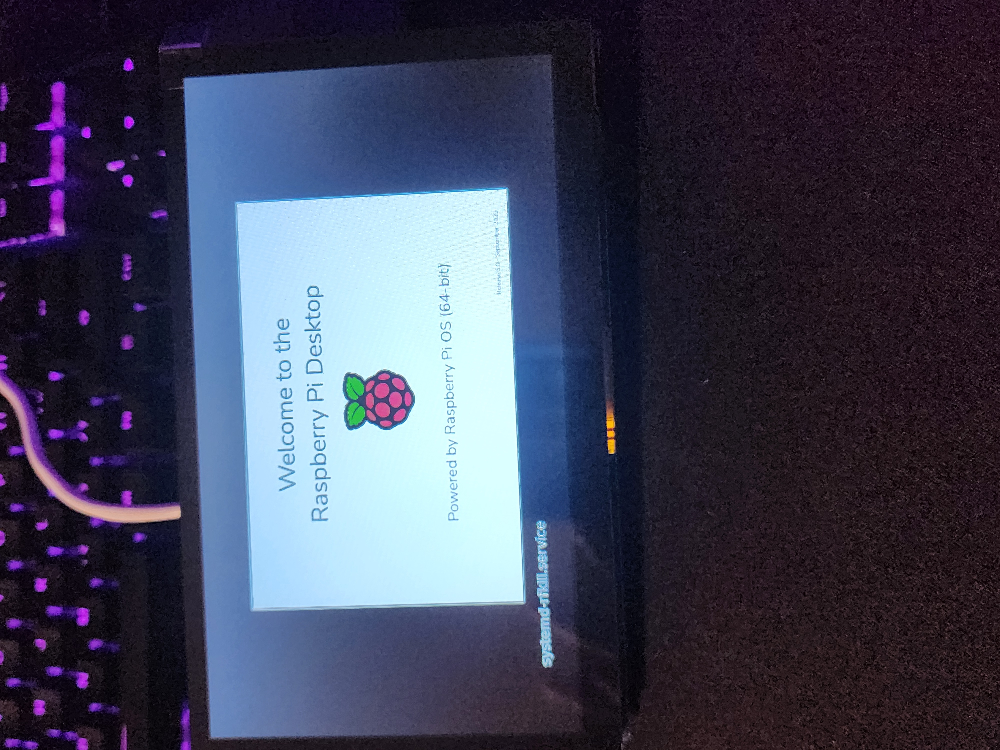
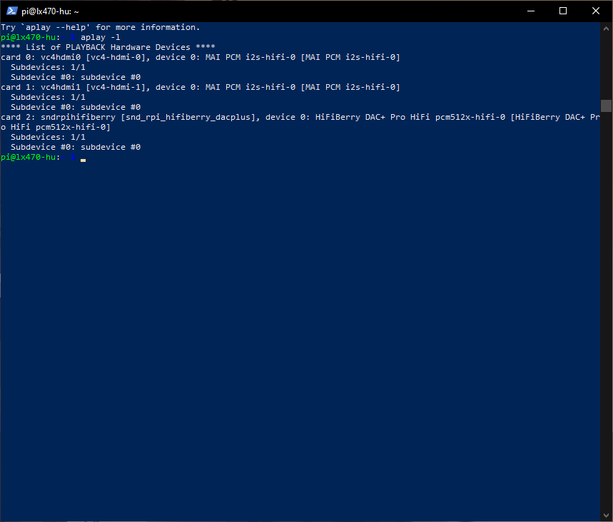
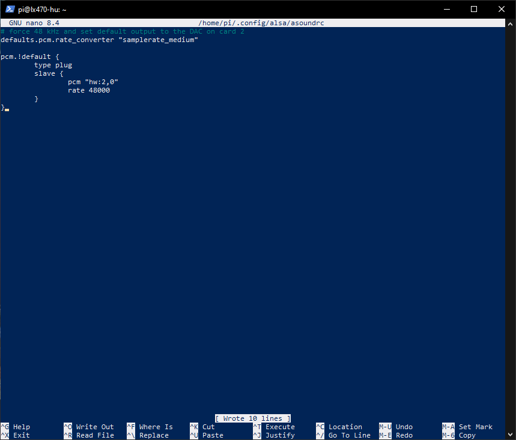
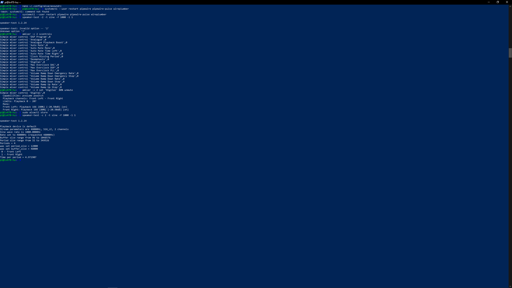

# M1 – Bench Bring-Up (Compute + Display + Audio)

## 1. Hardware Baseline

- Raspberry Pi 5 (8 GB)
- PCM5122 DAC HAT (HiFiBerry DAC+ compatible)
- DSI display (model: Hoysond 7 inch DSI powered touchscreen) - subject to change
- Powered desktop speakers - testing purposes only

## Photos

## 2. OS Flashing & First Boot

**Goal:** Get Raspberry Pi OS Lite (64-bit) running on the Pi 5 with console output on the DSI display.

**Actions:**
- Flashed Raspberry Pi OS Lite (64-bit) using Raspberry Pi Imager.
  - Hostname: `lx470-hu`
  - SSH enabled for remote access.
  - User: `pi`
- Inserted the 128 GB microSD and powered the Pi 5 with the official 27 W supply.
- Verified first boot on the DSI display and logged in via console.

**Verification:**
- `systemd-analyze time` reported ~14 s total boot time (kernel + userspace).
- Console login prompt visible on the DSI panel.
- Network configured (eventually got `hostname -I` to show an IP and could SSH in).

## Photos

## 3. Audio Bring-Up (PCM5122 DAC HAT)

**Goal:** Get clean stereo audio out of the PCM5122 DAC HAT into powered desktop speakers.

**Actions:**
- Added `dtoverlay=hifiberry-dacplus` to `/boot/firmware/config.txt`.
- Rebooted and confirmed the DAC appears as `card 2: snd_rpi_hifiberry_dacplus` in `aplay -l`.
- Created `~/.config/alsa/asoundrc` to set the default device to `hw:2,0` at 48 kHz.
- Set the `Digital` mixer on card 2 to 80% and stored ALSA state with `alsactl store`.
- Connected RCA outputs to powered desktop speakers and ran `speaker-test`.

**Verification:**
- `speaker-test -c 2 -t sine -f 1000 -l 1` produced a clean tone on both left and right channels.
- No pops or crackles during start/stop.
- At normal listening levels (~50% speaker volume), the noise floor was effectively inaudible.
- With speaker volume and gain at 100%, a light hiss was audible (expected behavior of consumer powered speakers at max gain, not a DAC defect).

**Photos:**

## Build Notes & Gotchas

- Display standoff mounts come with stickers covering the threads; these must be removed before installing standoffs.
- DSI connectors require the latch to be fully lifted before inserting the ribbon; partial insertion gives a black screen but no error.
- The display requires a +/- pin contact forcing the pi to be mounted; a workaround would be required to have the Pi mounted elsewhere.

